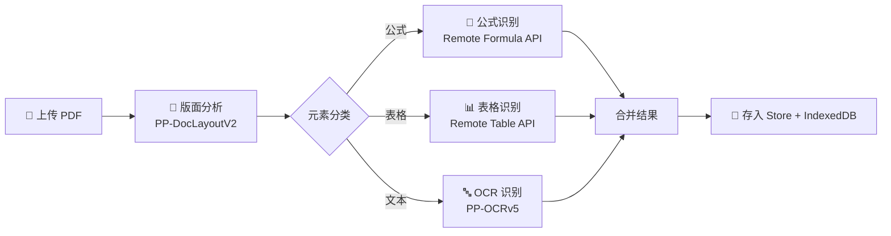
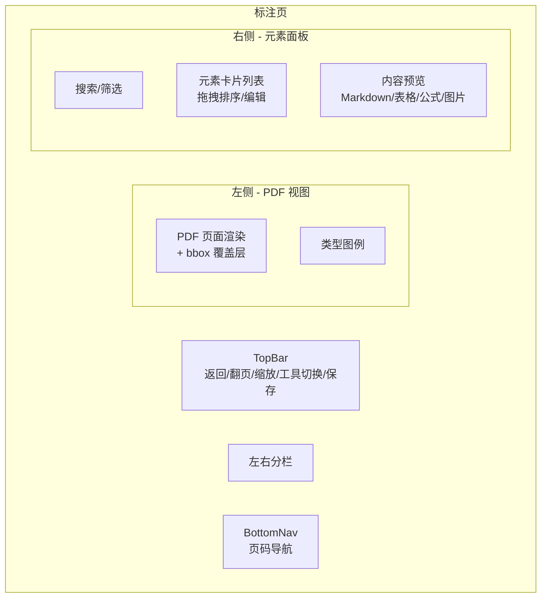
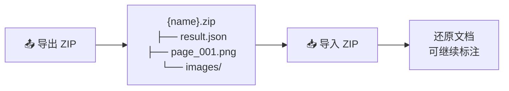
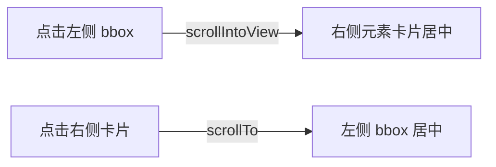
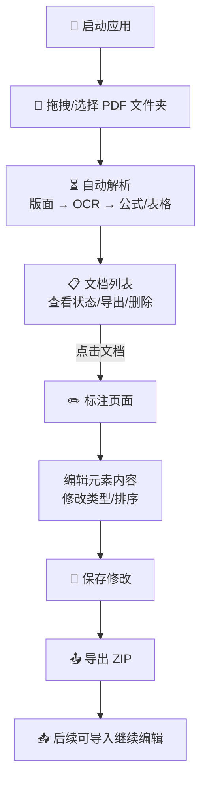

# Doc Parser Data Engine

PDF 文档解析与标注工具——将 PDF 转换为结构化数据，支持版面分析、OCR 识别、公式/表格提取，并提供可视化标注界面。

## 项目架构

```
doc_parser_data_engine/
├── backend/                    # Python FastAPI OCR 服务
│   ├── api_ocr.py              # 主服务（布局检测 + OCR 识别 + 公式/表格 API）
│   ├── requirements.txt        # Python 依赖
│   ├── Dockerfile              # 容器化部署
│   └── start.sh                # 开发启动脚本
│
├── frontend/                   # React + TypeScript 前端
│   ├── src/
│   │   ├── api/                # API 调用层
│   │   ├── components/         # UI 组件
│   │   │   ├── left-panel/     # PDF 渲染 + bbox 覆盖层
│   │   │   ├── right-panel/    # 元素列表 + 内容编辑
│   │   │   ├── TopBar.tsx      # 顶部工具栏
│   │   │   └── BottomNav.tsx   # 底部页码导航
│   │   ├── screens/            # 页面路由
│   │   │   ├── ListScreen.tsx  # 文档列表（上传/导出/导入）
│   │   │   └── AnnotateScreen.tsx  # 标注页
│   │   ├── store/              # Zustand 状态管理
│   │   ├── types/              # TypeScript 类型定义
│   │   ├── utils/              # 工具函数
│   │   ├── constants/          # 常量（元素类型、颜色）
│   │   └── styles/             # CSS 样式（设计令牌体系）
│   ├── package.json
│   └── vite.config.ts
│
└── openspec/                   # 变更提案与规范文档
```

## 核心功能

### 1. PDF 解析流水线



### 2. 标注界面



### 3. 数据导入导出



### 4. 左右面板联动



## 支持的元素类型

| 类型 | 颜色 | 渲染方式 |
|------|------|----------|
| text / title / header / footer | 🔵 蓝 | Markdown 文本 |
| table | 🟢 绿 | HTML 表格 |
| figure / image / chart | 🟠 橙 | 裁切图 |
| equation / formula | 🟣 紫 | LaTeX 公式 |

## 技术栈

| 层 | 技术 |
|----|------|
| **前端框架** | React 19 + TypeScript 6 |
| **构建工具** | Vite 8 |
| **状态管理** | Zustand 5 |
| **PDF 渲染** | react-pdf + pdfjs-dist |
| **Markdown** | react-markdown + KaTeX |
| **代码编辑** | CodeMirror 6 |
| **拖拽排序** | @dnd-kit |
| **样式** | CSS Custom Properties（设计令牌体系） |
| **本地存储** | localStorage + IndexedDB |
| **后端框架** | FastAPI (Python 3.11) |
| **OCR 引擎** | PaddleOCR (PP-OCRv5) |
| **版面分析** | PP-DocLayoutV2 |
| **公式识别** | Remote Formula API |
| **表格识别** | Remote Table API |

## 环境要求

| 组件 | 版本 |
|------|------|
| Node.js | ≥ 18 |
| Python | 3.11+ |
| pip | 最新 |

## 快速启动

### 1. 后端

```bash
cd backend
pip install -r requirements.txt
python api_ocr.py
# 服务启动在 http://localhost:8002
```

### 2. 前端

```bash
cd frontend
npm install
npm run dev
# 开发服务器启动在 http://localhost:5173
```

### 3. 配置 API 地址

编辑 `frontend/.env`：

```env
VITE_LAYOUT_API_URL=http://localhost:8002
VITE_OCR_MODEL_API_URL=http://localhost:8002
VITE_PARSE_CONCURRENCY=3
```

## 使用流程



## 后端 API

| 端点 | 方法 | 功能 |
|------|------|------|
| `/api/health` | GET | 健康检查 |
| `/api/layout` | POST | 版面分析（检测文本框/表格/公式/图片区域） |
| `/api/parse` | POST | OCR 解析（对指定区域进行文字识别） |

## Docker 部署

```bash
cd backend
docker build -t doc-parser-backend .
docker run -p 8002:8002 doc-parser-backend
```

## 项目规范

- **设计令牌**: CSS 自定义属性定义在 `:root`，所有颜色通过 `var()` 引用
- **元素坐标**: 使用 bbox 格式 `[left, top, right, bottom]`
- **变更管理**: 使用 OpenSpec 流程（`/opsx-propose` → `/opsx-apply` → `/opsx-archive`）
- **代码风格**: Prettier + ESLint flat config
