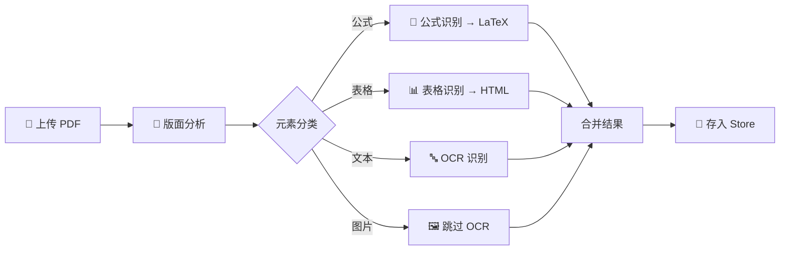
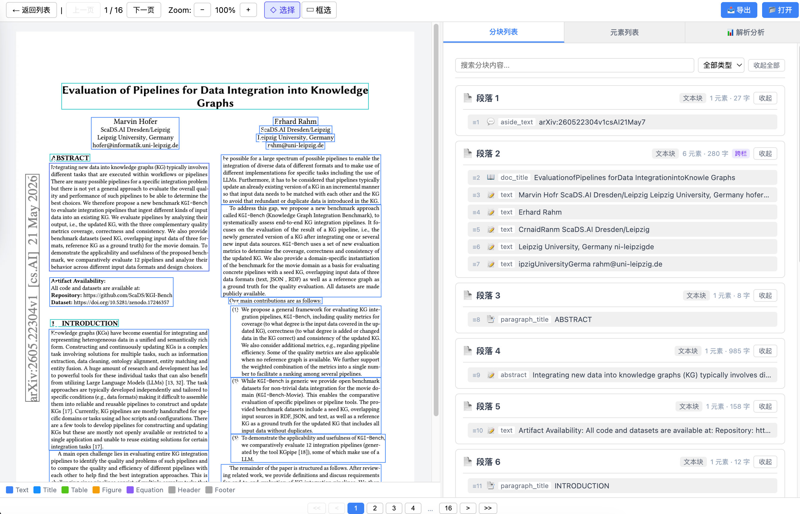
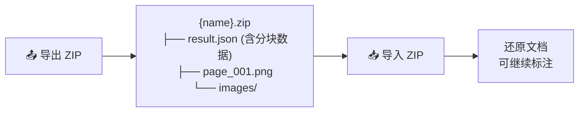
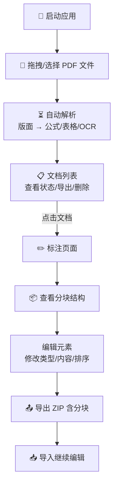

# Doc Parser Data Engine

PDF 文档解析与标注工具——将 PDF 转换为结构化数据，支持版面分析、OCR 识别、公式/表格提取，并提供可视化标注界面。


## 项目架构

```
doc_parser_data_engine/
├── backend/                          # Python FastAPI 服务
│   ├── api_ocr.py                    # 主服务入口
│   ├── pipeline.py                   # 解析流水线（服务编排 + 类型路由）
│   ├── requirements.txt              # Python 依赖
│   ├── Dockerfile                    # 容器化部署
│   ├── start.sh                      # 开发启动脚本
│   └── skills/                       # 本地 ML 服务参考文档
│       ├── doclayout/SKILL.md        # 版面分析 (PP-DocLayoutV3, :8765)
│       ├── ocr-det/SKILL.md          # 文字检测 (PP-OCRv5, :8766)
│       ├── formulanet/SKILL.md       # 公式识别→LaTeX (PP-FormulaNet, :8767)
│       └── slanet/SKILL.md           # 表格识别→HTML (SLANet, :8768)
│
├── frontend/                         # React + TypeScript 前端
│   ├── src/
│   │   ├── api/                      # API 调用层 (配置, 模型请求, 类型)
│   │   ├── components/
│   │   │   ├── left-panel/           # PDF 渲染 + bbox 覆盖层 + 分块高亮
│   │   │   ├── right-panel/          # 右侧面板
│   │   │   │   ├── ChunkList.tsx     # 分块列表组件
│   │   │   │   ├── RightPanel.tsx    # 面板容器 (三 Tab)
│   │   │   │   ├── ContentEditor.tsx # 内容编辑器 (CodeMirror)
│   │   │   │   ├── TypeSelector.tsx  # 类型选择器
│   │   │   │   └── ParseQualityPanel.tsx  # 解析质量分析
│   │   │   ├── TopBar.tsx            # 顶部工具栏 (翻页/缩放/导出)
│   │   │   ├── BottomNav.tsx         # 底部页码导航
│   │   │   ├── PdfListView.tsx       # 文档列表 (上传/导出/导入)
│   │   │   ├── ResizableSplit.tsx    # 可拖拽分栏
│   │   │   └── FolderUpload.tsx      # 文件夹上传
│   │   ├── screens/                  # 页面路由
│   │   │   ├── ListScreen.tsx        # 文档列表页
│   │   │   └── AnnotateScreen.tsx    # 标注页
│   │   ├── store/                    # Zustand 状态管理
│   │   │   ├── useAnnotationStore.ts # 标注状态
│   │   │   └── useDocumentListStore.ts # 文档列表状态
│   │   ├── types/                    # TypeScript 类型定义
│   │   │   ├── omnidoc.ts            # 元素/分块/列布局类型
│   │   │   ├── document.ts           # 文档模型类型
│   │   │   └── storage.ts            # 存储类型
│   │   ├── utils/
│   │   │   ├── chunk.ts              # 分块计算算法 (合并/列检测)
│   │   │   ├── parsePdf.ts           # PDF 解析流水线
│   │   │   ├── exportZip.ts          # ZIP 导出 (含分块数据)
│   │   │   ├── importZip.ts          # ZIP 导入
│   │   │   ├── poly.ts               # 多边形坐标工具
│   │   │   ├── quality.ts            # 解析质量计算
│   │   │   └── idb.ts                # IndexedDB 存储
│   │   ├── constants/                # 常量 (元素类型/颜色/图标)
│   │   ├── styles/                   # CSS 样式 (设计令牌体系)
│   │   └── mock/                     # Mock 数据
│   ├── .env.example                  # 环境变量模板
│   ├── package.json
│   └── vite.config.ts
│
├── openspec/                         # 变更提案与规范文档
└── README.md
```

## 核心功能

### 1. PDF 解析流水线


```mermaid
flowchart LR
    A[📄 上传 PDF] --> B[📐 版面分析]
    B --> C{元素分类}
    C -->|公式| D[🔢 公式识别 → LaTeX]
    C -->|表格| E[📊 表格识别 → HTML]
    C -->|文本| F[🔤 OCR 识别]
    C -->|图片| G[🖼️ 跳过 OCR]
    D --> H[合并结果]
    E --> H
    F --> H
    G --> H
    H --> I[💾 存入 Store]
```

解析流水线自动将元素按类型路由到不同服务：

| 元素类型 | 服务 | 输出 |
|----------|------|------|
| formula / equation | formulanet:8767 | LaTeX 代码 |
| table | slanet:8768 | HTML 表格 |
| text / title / ... | PP-OCRv5 本地 | 纯文本 |
| figure / image / chart | — | 跳过 |

### 2. 标注界面



**右侧面板三 Tab**：
- **分块列表** — 自动合并相邻文字为段落块；表格/图片独立成块；支持搜索/筛选/展开/收起
- **元素列表** — 单元素卡片，拖拽排序，内容编辑 (Markdown/LaTeX/HTML)，类型修改
- **解析分析** — 置信度分布、类型统计、降级元素列表

**分块合并策略**：
- 表格 (table)、图片 (figure/image/chart) 单独成块
- 标题与后续正文合并到同一段落块
- 段落累计超 500 字符自动截断
- 页码 (page_number/number) 被忽略

**交互联动**：
- 点击左侧 bbox → 右侧对应元素/分块滚动居中
- 点击右侧分块 → 左侧 PDF 视图居中到该分块，所有子元素高亮 + 虚线边界框
- 点击元素 → 分块联动定位

### 3. 数据导入导出


```mermaid
flowchart LR
    A[📤 导出 ZIP] --> B["{name}.zip\n├── result.json (含分块数据)\n├── page_001.png\n└── images/"]
    B --> C[📥 导入 ZIP]
    C --> D[还原文档\n可继续标注]
```

**导出格式** (`result.json`)：

```json
{
  "document_name": "example.pdf",
  "total_pages": 1,
  "pages": [{
    "page_number": 1,
    "image_path": "page_001.png",
    "page_info": { "width": 595, "height": 842 },
    "elements": [{
      "category_type": "text",
      "poly": [100, 200, 400, 250],
      "order": 0,
      "text": "段落内容..."
    }],
    "chunks": [
      { "label": "段落 1", "type": "text_block", "element_indices": [0,1,2], "char_count": 450 },
      { "label": "表格 1", "type": "table", "element_indices": [3], "char_count": 120 }
    ]
  }]
}
```

- 标注页 TopBar 和文档列表页均有「导出」按钮
- `element_indices` 引用同页 `elements` 的 `order` 字段

### 4. 本地 ML 服务

以下服务运行在 Mac 本机，通过 launchd 管理开机自启：

| 服务 | 端口 | 模型 | 功能 |
|------|------|------|------|
| doclayout | 8765 | PP-DocLayoutV3 | 版面分析（标题/正文/表格/图片/公式） |
| ocr-det | 8766 | PP-OCRv5_server_det | 文字检测（行位置 + 旋转框） |
| formulanet | 8767 | PP-FormulaNet_plus-L | 公式识别 → LaTeX |
| slanet | 8768 | SLANet_plus | 表格识别 → HTML |

**调用策略**：后端 `pipeline.py` 先尝试远程服务，失败自动回退到本地 PP-OCRv5。

各服务的详细 API 文档和启动指令见 `backend/skills/<name>/SKILL.md`。

## 支持的元素类型

| 类型 | 颜色 | 渲染方式 |
|------|------|----------|
| text / title / paragraph_title / doc_title | 🔵 蓝 | Markdown 文本 |
| table | 🟢 绿 | HTML 表格 |
| figure / image / chart | 🟠 橙 | 裁切图 |
| equation / formula / display_formula | 🟣 紫 | LaTeX 公式 (KaTeX) |
| header / footer | ⬜ 灰 | Markdown 文本 |
| abstract / footnote / reference / aside_text | 🔵 蓝 | Markdown 文本 |
| code_txt | 💻 蓝 | Markdown 文本 |

## 技术栈

| 层 | 技术 | 说明 |
|----|------|------|
| **前端框架** | React 19 + TypeScript | 组件化 UI |
| **构建工具** | Vite 8 | HMR 极速开发 |
| **状态管理** | Zustand 5 | 轻量级全局状态 |
| **PDF 渲染** | react-pdf + pdfjs-dist | 页面渲染 + 覆盖层 |
| **Markdown** | react-markdown + KaTeX | 文本 + 公式渲染 |
| **代码编辑** | CodeMirror 6 | 内容编辑 |
| **拖拽排序** | @dnd-kit | 元素拖拽重排 |
| **HTML 净化** | DOMPurify | XSS 防护 |
| **ZIP 打包** | JSZip | 导入导出 |
| **本地存储** | localStorage + IndexedDB | 数据持久化 |
| **后端框架** | FastAPI (Python 3.11) | REST API |
| **OCR 引擎** | PaddleOCR (PP-OCRv5) | 文字识别 |
| **版面分析** | PP-DocLayoutV3 (远程) / V2 (回退) | 文档布局检测 |
| **公式识别** | PP-FormulaNet_plus-L | 公式 → LaTeX |
| **表格识别** | SLANet_plus | 表格 → HTML |

## 环境要求

| 组件 | 版本 |
|------|------|
| Node.js | ≥ 18 |
| Python | 3.11+ |
| pip | 最新 |

## 快速启动

### 1. 后端

```bash
cd backend
pip install -r requirements.txt
python api_ocr.py
# 服务启动在 http://localhost:8002
```

### 2. 前端

```bash
cd frontend
npm install
npm run dev
# 开发服务器启动在 http://localhost:5173
```

### 3. 配置

编辑 `frontend/.env`：

```env
VITE_LAYOUT_API_URL=http://localhost:8002
VITE_OCR_API_URL=http://localhost:8002
VITE_PARSE_CONCURRENCY=3
```

### 4. 本地 ML 服务 (可选)

如需使用专项识别能力，启动对应的 launchd 服务：

```bash
# 版面分析 V3 (推荐)
launchctl bootstrap gui/$(id -u) ~/Library/LaunchAgents/ai.openclaw.doclayout.plist

# 公式识别 → LaTeX
launchctl bootstrap gui/$(id -u) ~/Library/LaunchAgents/ai.openclaw.formulanet.plist

# 表格识别 → HTML
launchctl bootstrap gui/$(id -u) ~/Library/LaunchAgents/ai.openclaw.slanet.plist
```

## 使用流程


```mermaid
flowchart TD
    START[🚀 启动应用] --> UPLOAD[📁 拖拽/选择 PDF 文件]
    UPLOAD --> PARSE[⏳ 自动解析\n版面 → 公式/表格/OCR]
    PARSE --> LIST[📋 文档列表\n查看状态/导出/删除]
    LIST -->|点击文档| ANNOTATE[✏️ 标注页面]
    ANNOTATE --> CHUNK[📦 查看分块结构]
    CHUNK --> EDIT[编辑元素\n修改类型/内容/排序]
    EDIT --> EXPORT[📤 导出 ZIP 含分块]
    EXPORT --> IMPORT[📥 导入继续编辑]
```

## 后端 API

| 端点 | 方法 | 功能 |
|------|------|------|
| `/api/health` | GET | 健康检查（含远程服务状态） |
| `/api/layout` | POST | 版面分析（优先远程 V3，回退本地 V2） |
| `/api/parse` | POST | 元素解析（自动路由到公式/表格/OCR 服务） |

## Docker 部署

```bash
cd backend
docker build -t doc-parser-backend .
docker run -p 8002:8002 doc-parser-backend
```

## 项目规范

- **设计令牌**: CSS 自定义属性定义在 `:root`，所有颜色通过 `var()` 引用
- **元素坐标**: 使用 bbox 格式 `[left, top, right, bottom]`，支持 8 点多边形
- **变更管理**: 使用 OpenSpec 流程 (`/opsx-propose` → `/opsx-apply` → `/opsx-archive`)
- **代码风格**: Prettier + ESLint flat config (前端)，Python 原生 (后端)
