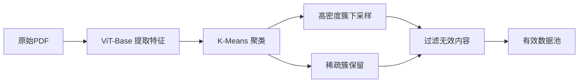
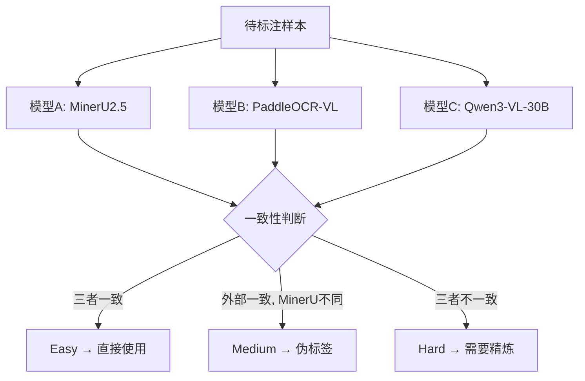
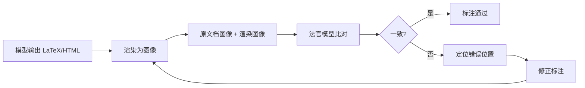
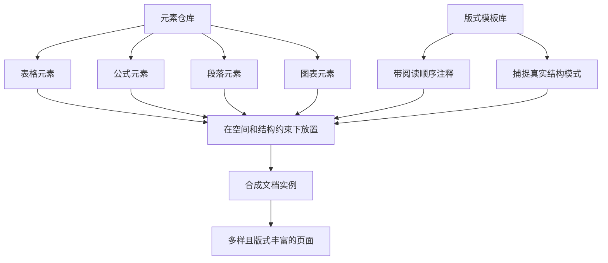
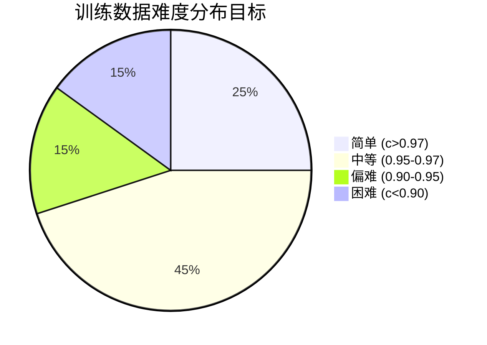

# 文档解析数据工程方案

> 基于 22 篇行业前沿文章综合设计，融合 MinerU2.5-Pro、PP-OCRv5、FireRed-OCR-2B 等最佳实践。
> 核心观点：**当前文档解析的性能瓶颈在数据，不在架构。**
> 场景定位：**通用 PDF 场景**（论文、发票、财报等），含完整可视化标注流程。

## 一、问题诊断

### 1.1 行业现状

不同架构、不同参数规模的模型（MinerU2.5 vs PaddleOCR-VL-1.5 vs Qwen3-VL-30B），在**完全相同的困难样本**上犯同样的错误：
- 嵌套表格识别失败
- 密集数学公式识别失败
- 多列复杂布局识别失败

**结论**：失败模式高度一致 → 瓶颈在训练数据，不在模型架构。

### 1.2 两大核心问题

| 问题 | 描述 | 影响 |
|------|------|------|
| **覆盖度不足** | 数据集中于高频类别（标准学术论文），长尾场景（嵌套表格、密集公式、多栏排版）严重缺失 | 模型从未见过这些场景 |
| **标注质量悖论** | 最难解析的样本，恰恰是自动标注最不可靠的样本 | 硬样本噪声大，直接训练会"教坏"模型 |

### 1.3 PP-OCRv5 的三条经验结论

1. **数据难度筛选**：应筛选中等难度样本，避开低质量噪声和无信息简单样本
2. **容忍适度标签噪声**：20% 标签噪声仅导致 1.33% 性能下降，可用大模型自动标注
3. **优先保证数据多样性**：特征空间覆盖是泛化能力的核心，多样性 > 数据量

## 二、整体架构

```mermaid
graph TB
    subgraph 阶段一：数据获取
        A1[原始 PDF 池] --> A2[去重 & 清洗]
        A2 --> A3[DDAS 多样性+难度采样]
    end
    
    subgraph 阶段二：难度分层
        A3 --> B1[CMCV 跨模型一致性验证]
        B1 --> B2[Easy 样本]
        B1 --> B3[Medium 样本]
        B1 --> B4[Hard 样本]
    end
    
    subgraph 阶段三：标注增强
        B2 --> C1[直接使用]
        B3 --> C2[外部共识伪标签]
        B4 --> C3[Judge-and-Refine]
        C3 --> C4[渲染验证迭代]
        C4 --> C5[专家标注兜底]
    end
    
    subgraph 阶段四：数据合成
        D1[元素仓库] --> D2[DocMix 模板合成]
        D2 --> D3[难例定向合成]
        D3 --> B4
    end
    
    subgraph 阶段五：训练策略
        C1 --> E1[大规模预训练]
        C2 --> E1
        C5 --> E2[硬样本微调]
        E1 --> E2
        E2 --> E3[GRPO 对齐]
    end
    
    style A1 fill:#fce4ec
    style B1 fill:#fff3e0
    style C3 fill:#e8f5e9
    style D1 fill:#e3f2fd
    style E1 fill:#f3e5f5
```

## 三、详细设计

### 3.1 阶段一：数据获取与采样

#### 3.1.1 原始数据池构建

| 数据类型 | 来源 | 规模目标 |
|----------|------|----------|
| 学术论文 | arXiv, PubMed | 2000万页 |
| 金融文档 | 年报, 招股书 | 500万页 |
| 法律文档 | 判决书, 合同 | 300万页 |
| 政府报告 | 白皮书, 政策文件 | 200万页 |
| 教材/图书 | 扫描版 PDF | 500万页 |
| 票据/发票 | 真实业务数据 | 200万页 |
| 合成数据 | DocMix 生成 | 按需补充 |

#### 3.1.2 去重 & 清洗



**操作要点**：
- 用 ViT-Base 提取每页视觉特征向量
- K-Means 聚类（建议 1000-5000 簇）
- 高密度簇（如纯文本页）下采样去重
- 稀疏簇（复杂版式）优先保留
- 过滤：空白页、非目标语言、纯图片页

#### 3.1.3 DDAS 采样（Diversity & Difficulty-Aware Sampling）

**页面级采样**：
- 按 cluster 中 Hard 样本比例调整权重
- Hard 多的 cluster → 提高采样概率
- Easy 多的 cluster → 降低采样概率

**元素级采样**：
- 对 text / formula / table 分别独立聚类
- 确保每种元素类型都有足够难例覆盖
- 目标：从 <1000万页 → 6500万页（参考 MinerU2.5-Pro）

### 3.2 阶段二：难度分层

#### 3.2.1 CMCV 跨模型一致性验证



**关键设计**：
- 选择**异构模型**（不同架构、不同训练数据）
- **Medium 样本训练价值最高**：别的模型能做对，当前模型做不对 → 可学且有可靠标注
- 参考 PP-OCRv5 甜区理论：用自举模型置信度辅助判断（0.95-0.97 为最优难度区间）

#### 3.2.2 难度量化指标

借鉴 PP-OCRv5 的置信度难度评分：

```
c = mean(softmax_prob for each character)
```

| 置信度区间 | 难度等级 | 处理方式 |
|-----------|---------|---------|
| c > 0.97 | 简单 | 无信息量，可降采样 |
| 0.95-0.97 | **中等（甜区）** | **最优训练样本，优先保留** |
| 0.90-0.95 | 偏难 | 保留，需验证标注 |
| c < 0.90 | 困难 | 需人工介入或精炼 |

### 3.3 阶段三：标注增强

#### 3.3.1 Judge-and-Refine 流水线

**核心洞见**：模型擅长从图像生成结构文本，但不擅长从文本反推视觉布局。



**操作流程**：
1. 将模型输出的 LaTeX 公式 / HTML 表格**重新编译渲染为图像**
2. 渲染过程将细微结构错误放大为视觉显著异常
3. 法官模型（Qwen3-VL-235B 级别）比对原文档和渲染图
4. 定位并修正错误 → 重新渲染 → 迭代直至一致
5. 超出自动修正能力的 → 定向专家标注

#### 3.3.2 专家标注策略

**不是全量标注，是精准定向**：
- 优先标注法官模型已高置信度定位错误位置的样本
- 优先标注当前模型最弱的任务类别
- 最大化有限标注资源的边际贡献

**目标产出**：
- ~6500万 简单/中等样本 → 大规模预训练
- ~19万 专家标注硬样本 → 高质量微调

### 3.4 阶段四：数据合成

#### 3.4.1 DocMix 模板合成



**操作要点**：
- 从多源构建标准化元素仓库（表格、公式、段落、图表）
- 收集带注释阅读顺序的版式模板
- 在空间和结构约束下将元素放置到模板中
- 生成目标：补充长尾场景（嵌套表格、密集公式、多栏排版）

#### 3.4.2 合成数据质量验证

- 合成数据必须通过 CMCV 验证流程
- 仅当多模型一致性达到阈值时，才纳入训练集
- 合成数据与真实数据混合训练时，需控制比例

### 3.5 阶段五：渐进式训练

| 阶段 | 数据 | 目标 | 预期增益 |
|------|------|------|---------|
| **1. 大规模预训练** | 6500万自动标注样本 | 建立全面基础能力 | +1.31 分 |
| **2. 硬样本微调** | 19万专家标注 + 回放数据 | 强化硬场景，防止遗忘 | 表格 +2.50 分 |
| **3. GRPO 对齐** | 阶段2模型采样生成 | 直接优化评测指标 | 公式 +0.81 分 |

**关键策略**：
- **CPT 非必需**：若基础模型上下文长度已覆盖评估基准，SFT 或 LongPO 单独即可
- **训练长度匹配**：训练上下文与评估基准匹配 > 训练更长上下文
- **页码索引**：训练和评估中加入显式页码索引，低成本大幅提升性能
- **模型融合**：解决灾难性遗忘，保留常规指令跟随能力

## 四、数据质量指标体系

### 4.1 三维量化

| 维度 | 指标 | 目标 | 工具 |
|------|------|------|------|
| **难度** | 自举置信度 c | 甜区 0.95-0.97 占比 > 40% | 自举模型 |
| **准确率** | 标签噪声率 | < 20% 可接受 | 注入噪声实验 |
| **多样性** | 聚类簇数 | > 1000 簇 | CLIP + K-Means |

### 4.2 数据分布目标



### 4.3 元素覆盖度

| 元素类型 | 基础场景 | 长尾场景 | 目标覆盖率 |
|----------|---------|---------|-----------|
| 文本 | 单栏、多栏 | 竖排、艺术字、古籍 | > 95% |
| 公式 | 行内公式 | 多行对齐、大括号、矩阵 | > 90% |
| 表格 | 简单表格 | 嵌套表格、跨行跨列 | > 85% |
| 图表 | 柱状图、饼图 | 流程图、架构图 | > 80% |

## 五、实施路线

### Phase 1：基础设施（第 1-2 周）

- [ ] 搭建原始 PDF 数据池（目标 5000万+ 页）
- [ ] 部署 ViT-Base 特征提取 + 聚类 pipeline
- [ ] 准备 2-3 个异构模型用于 CMCV（MinerU / PaddleOCR-VL / Qwen3-VL）
- [ ] 搭建 Judge-and-Refine 渲染验证环境

### Phase 2：数据引擎运行（第 3-5 周）

- [ ] 运行 DDAS 采样，扩充数据池至目标规模
- [ ] 运行 CMCV 难度分层，产出 Easy/Medium/Hard 分类
- [ ] 对 Hard 样本启动 Judge-and-Refine 流程
- [ ] 对 Medium 样本进行上采样（训练价值最高）

### Phase 3：合成数据补充（第 4-6 周）

- [ ] 构建元素仓库（表格、公式、段落、图表）
- [ ] 收集版式模板，建立 DocMix 合成 pipeline
- [ ] 针对嵌套表格、密集公式等长尾场景定向合成
- [ ] 合成数据通过 CMCV 验证后纳入训练集

### Phase 4：训练与评估（第 6-8 周）

- [ ] 阶段1：大规模预训练（6500万样本）
- [ ] 阶段2：硬样本微调 + 回放
- [ ] 阶段3：GRPO 对齐优化
- [ ] OmniDocBench v1.6 评估，对比基线

### Phase 5：迭代优化（持续）

- [ ] 分析 Hard 子集错误模式
- [ ] 定向补充缺失场景数据
- [ ] 更新 .wiki-schema.md 数据规则
- [ ] 回流开发经验到 wiki

## 六、风险与对策

| 风险 | 影响 | 对策 |
|------|------|------|
| 标注成本过高 | 项目延期 | Judge-and-Refine 优先，专家标注兜底 |
| 合成数据真实性不足 | 模型过拟合 | CMCV 验证 + 真实数据混合训练 |
| 聚类质量不佳 | 多样性保证失效 | 用 CLIP 视觉编码器，定期人工抽查 |
| 训练灾难性遗忘 | 已有能力退化 | 模型融合 + 回放数据 |

## 七、参考来源

本文档综合了以下 22 篇文章的最佳实践：

| 核心参考 | 贡献 |
|----------|------|
| [[2026-04-11-2026-04-MinerU2.5-Pro数据驱动]] | 数据引擎四组件、渐进式训练策略 |
| [[2026-04-11-2026-04-文档解析瓶颈不是架构]] | 瓶颈诊断、cross-analysis 方法 |
| [[2026-04-11-2026-04-PP-OCRv5数据策略]] | 难度甜区理论、DocMix-3M 合成 |
| [[2026-04-11-2026-04-Qwen3.5与FireRed-OCR]] | 聚类去重、长尾挖掘、多维标签索引 |
| [[2026-04-11-2026-04-长文档多模态训练]] | CPT/SFT/LongPO 三方式、页码索引 |
| [[2026-04-11-2026-04-PaddleOCR-VL数据挖掘]] | 难样本挖掘策略 |
| [[2026-04-11-2026-04-MinerU2.5-Pro开源]] | 整体方案概览 |
| [[2026-04-11-2026-04-文档layout布局检测]] | Layout 后处理细节 |

## 八、后续工作

- **Phase 2**：根据方案搭建数据 pipeline，开始运行
- **Phase 3**：配合 OpenSpec 将本方案转化为可执行规范
- **Phase 4**：使用 OpenCode 开发数据工程代码
- **Phase 5**：开发经验回流 wiki，更新本文档
